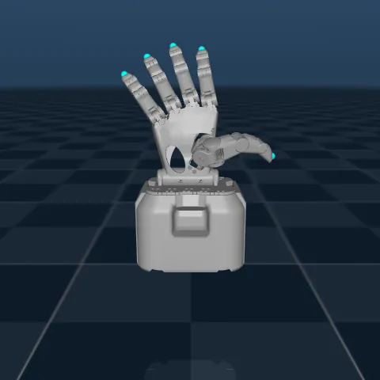
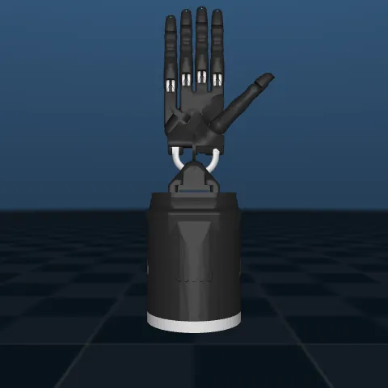
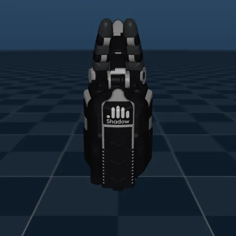
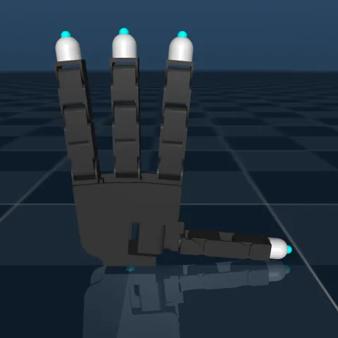
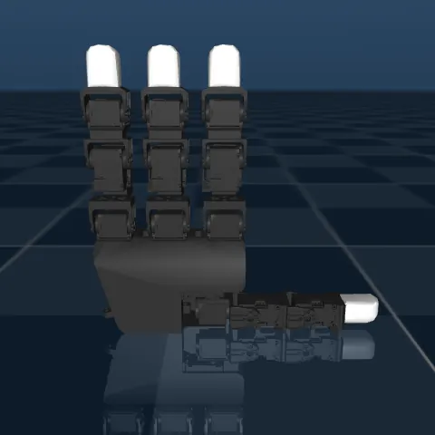
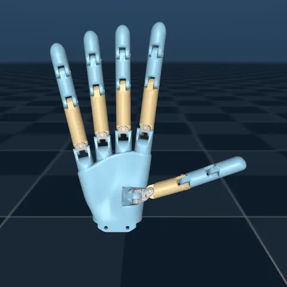
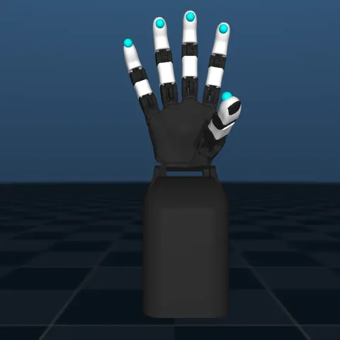

# mimic_retargeter_lab

## Introduction
Retargeting algorithms are what enable humans to bridge the embodiment gap with robotic hands. Here, we provide an implementation of different retargeters on different robot hands.

### Supported Hands

| Hand | Preview |
|------|---------|
| mimic P0.50 Hand (`mimic_p050_hand`) |  |
| Shadow Hand (`shadow_hand`) |  |
| Shadow DEXEE (`shadow_dexee_hand`) |  |
| Wonik Allegro Hand (`wonik_allegro_hand`) |  |
| LEAP Hand (`leap_hand`) |  |
| WuJi Hand (`wuji_hand`) |  |
| Orca V2 Hand (`orca_v2_hand`) |  |

> Previews are committed under `media/hands/`. To regenerate them, see [docs/regenerating_hand_previews.md](docs/regenerating_hand_previews.md).

### Supported Online Retargeters
- Joint Angle [`joint_angle`]
- Keyvector [`keyvector`]
- [Hybrid](https://arxiv.org/abs/2506.11916) [`hybrid`]
- [DexPilot](https://arxiv.org/abs/1910.03135) [`dexpilot`]
- [Analyzing Key Objectives (AKO)](https://arxiv.org/abs/2506.09384) [`ako`]
- Sampling-Based [`sampling_based`]
- [Geometric Retargeting](https://arxiv.org/abs/2503.07541) [`geort`]

*Note on running Sampling-Based Retargeter*: `sampling_based` requires a GPU to run because it is sampling many robot positions in parallel. If your system does not have a GPU, the performance will be extremely slow. 


## Installation & Setup

### Setting up the virtual environment 
`uv` is used as the environment and package manager. 

```bash
# Clone the repository
git clone https://github.com/mimicrobotics/mimic_dexworld.git
cd mimic_dexworld

# Install dependencies (creates ./.venv automatically)
uv sync

# Activate the environment
source .venv/bin/activate
```

#### Optional: GPU support

Everything runs on CPU out of the box. Only the `sampling_based` retargeter needs a GPU — if you have an NVIDIA card with a CUDA 12 driver, install the `gpu` extra:

```bash
uv sync --extra gpu
```

See [docs/jax_gpu_setup.md](docs/jax_gpu_setup.md) for verification, the `uv sync` pruning gotcha, and the JAX/MJX device rules to follow when writing a new entry script or GPU-capable retargeter.


### Pre-commit hooks

This repo uses [pre-commit](https://pre-commit.com/) to run `ruff check` and `ruff format` on every commit so contributions stay lint- and format-clean. After `uv sync`, enable the hooks once:

```bash
uv run pre-commit install
```

From then on, `git commit` will auto-run the hooks on staged files. If ruff rewrites anything, the commit aborts — stage the updated files and commit again. To run the full suite manually:

```bash
uv run pre-commit run --all-files
```

To bump hook versions (ruff, etc.) to the latest compatible release:

```bash
uv run pre-commit autoupdate
```

If you need to bypass hooks in an emergency, use `git commit --no-verify`. However, please don't make it a habit.

### Testing Setup
To test that the setup is complete, run the following tests:

1. Run offline retargeting from pre-recorded human hand data:
```
python scripts/run_offline_retargeting.py
```

2. Run metric computation and check that that the dashboard is operational:
```
python scripts/compute_hand_retargeter_pair_metrics.py
```

## Usage 

### Running offline retargeting
Some sample data is already included in the repository. Test the installation by running retargeting from pre-recorded human hands:

```bash
python scripts/run_offline_retargeting.py hand=shadow_hand retargeter=dexpilot
```

Available values for `hand` are the directory names under [`config/hand/`](config/hand/), and for `retargeter` the ones under [`config/retargeter/`](config/retargeter/).

### Evaluating one (hand, retargeter) pair

`compute_hand_retargeter_pair_metrics.py` scores a single **(hand, retargeter)** pair on a dataset and opens a dashboard for that one run at [http://127.0.0.1:8050/](http://127.0.0.1:8050/):

```bash
python scripts/compute_hand_retargeter_pair_metrics.py hand=wonik_allegro_hand retargeter=dexpilot
```

Results are cached to `reports/metrics-stats_<dataset>_<hand>_<retargeter>.pkl`, so you can re-open that run's dashboard later without recomputing — pass the same overrides:

```bash
python scripts/serve_single_pair_dashboard.py hand=wonik_allegro_hand retargeter=dexpilot
```

To compute the metrics without serving anything (useful in scripts), add `serve_dashboard=false`.

### Comparing every hand against every retargeter

The comparison dashboard reads the cached `reports/*.pkl` files rather than computing anything itself, so **populate them first**. [`run_all_metrics.sh`](scripts/run_all_metrics.sh) sweeps every hand × retargeter combination for you:

```bash
bash scripts/run_all_metrics.sh
```

That is 42 runs (6 hands × 7 retargeters) and takes a while — it is doing the retargeting work up front that the dashboard then just reads back. Edit the `DATASETS` / `HANDS` / `RETARGETERS` arrays at the top of the script to narrow the sweep.

Then serve the comparison, passing the dataset the sweep used:

```bash
python scripts/serve_all_pairs_dashboard.py --dataset manus
```

It auto-discovers every run it finds for that dataset. The **Summary** tab aggregates across all hands; the **Hand** tab drills into one hand at a time, comparing retargeters side by side. Narrow the view with repeatable `--retargeter` / `--include-hand` flags.

For a quick terminal table instead of a browser:

```bash
python scripts/summarize_metrics.py
```

## Integrating a New Robot Hand

See [docs/integrating_new_hand.md](docs/integrating_new_hand.md) for a full walkthrough of every file you need to create or modify to add support for a new robot hand.

## License

This project is licensed under [CC BY-NC 4.0](https://creativecommons.org/licenses/by-nc/4.0/) — free for non-commercial use with attribution. See [LICENSE](LICENSE) for details.

Third-party components are documented in [LICENSE_THIRD_PARTY.md](LICENSE_THIRD_PARTY.md).

## Citation

If you use the retargeting algorithm, please cite the paper:

```bibtex
@misc{malate2026_smoothoperator,
      title={Smooth Operator: A Real-Time Sampling-Based Algorithm for Kinematic Hand Retargeting}, 
      author={Robert Jomar Malate and Erik Bauer and Norica Bacuieti and Stefanos Charalambous and Elvis Nava and Robert K. Katzschmann and Benedek Forrai},
      year={2026},
      eprint={2607.07491},
      archivePrefix={arXiv},
      primaryClass={cs.RO},
      url={https://arxiv.org/abs/2607.07491}, 
}
```

If you use this codebase, please cite the repository:

```bibtex
@software{malate2026_mimicretargeterlab,
      title={mimic\_retargeter\_lab},
      author={Robert Jomar Malate and Erik Bauer and Norica Bacuieti and Stefanos Charalambous and Elvis Nava and Robert K. Katzschmann and Benedek Forrai},
      year={2026},
      url={https://github.com/mimicrobotics/mimic_retargeter_lab},
}
```

This citation metadata is also available in machine-readable form in [CITATION.cff](CITATION.cff), which enables GitHub's "Cite this repository" button.

## References

Using:

- URDFs from <https://github.com/dexsuite/dex-urdf>
- MCJFs from <https://github.com/google-deepmind/mujoco_menagerie>
- KBHit: <https://gist.github.com/michelbl/efda48b19d3e587685e3441a74457024>
- OAK-D Hand Tracker: <https://github.com/geaxgx/depthai_hand_tracker>
